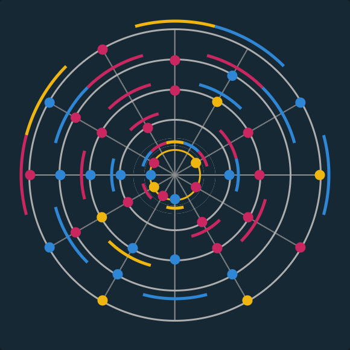

# Nopixel 4.0 L ockpick Solver
Script that uses computer vision to do lockpick minigame for you

Tested on https://maximilianadf.github.io/NoPixel-MiniGames-4.0/Laundromat/Laundromat.html


## Dependencies

1. Everything in the [requirements.txt](requirements.txt)

## Usage
``` python nopixel4_lockpick_solver.py```

## Config

You will have to update the zone for your screen resolution 
```
CAPTURE_ZONE = {"top": 236, "left": 3017, "width": 580, "height": 580}  # Inner zone around game
```
